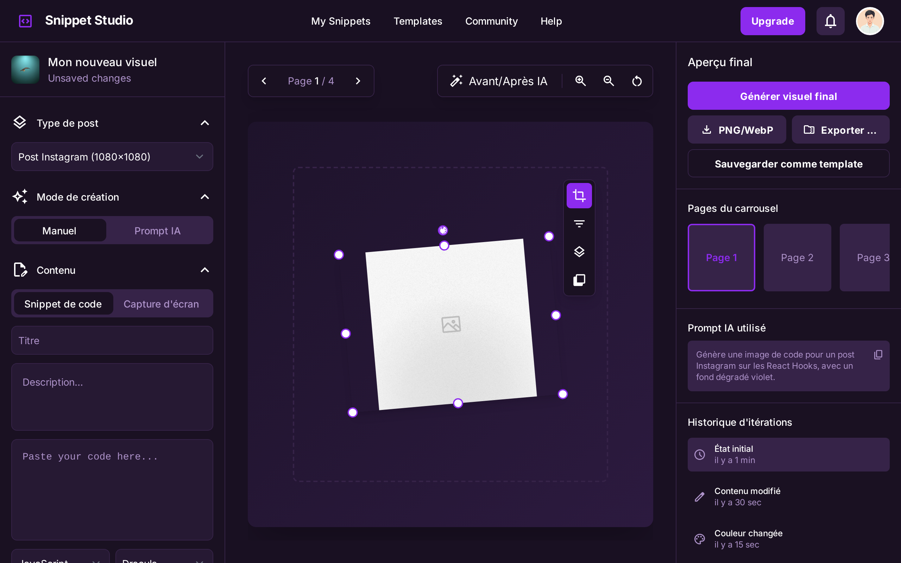

# Snippet Studio



Snippet Studio is a modern web application built with Next.js that allows developers and content creators to transform code snippets and screenshots into viral content for social media. Create stunning visuals for your technical posts in seconds.

## Features

- 🎨 **Real-time Customization** - Change themes, fonts, and colors instantly
- 📤 **Easy Import** - Paste code or drag-and-drop screenshots
- 📐 **Ready-to-use Templates** - Pre-configured formats for Twitter, LinkedIn, Instagram and more
- 💾 **High-quality Export** - Download creations in PNG or SVG for perfect clarity
- 🌙 **Dark Mode** - Beautiful dark theme for comfortable editing
- 📱 **Responsive Design** - Works on all devices from mobile to desktop

## Getting Started

First, run the development server:

```bash
npm run dev
# or
yarn dev
# or
pnpm dev
# or
bun dev
```

Open [http://localhost:3000](http://localhost:3000) with your browser to see the result.

You can start editing the page by modifying `app/page.tsx`. The page auto-updates as you edit the file.

This project uses [`next/font`](https://nextjs.org/docs/app/building-your-application/optimizing/fonts) to automatically optimize and load [Geist](https://vercel.com/font), a new font family for Vercel.

## Tech Stack

- [Next.js 16](https://nextjs.org/) - React framework with App Router
- [React 19](https://reactjs.org/) - JavaScript library for building user interfaces
- [TypeScript](https://www.typescriptlang.org/) - Typed superset of JavaScript
- [Tailwind CSS 4](https://tailwindcss.com/) - Utility-first CSS framework
- [Lenis](https://lenis.darkroom.engineering/) - Smooth scrolling library

## Learn More

To learn more about Next.js, take a look at the following resources:

- [Next.js Documentation](https://nextjs.org/docs) - learn about Next.js features and API.
- [Learn Next.js](https://nextjs.org/learn) - an interactive Next.js tutorial.

You can check out [the Next.js GitHub repository](https://github.com/vercel/next.js) - your feedback and contributions are welcome!

## Deploy on Vercel

The easiest way to deploy your Next.js app is to use the [Vercel Platform](https://vercel.com/new?utm_medium=default-template&filter=next.js&utm_source=create-next-app&utm_campaign=create-next-app-readme) from the creators of Next.js.

Check out our [Next.js deployment documentation](https://nextjs.org/docs/app/building-your-application/deploying) for more details.

## License

This project is open source and available under the [MIT License](LICENSE).
